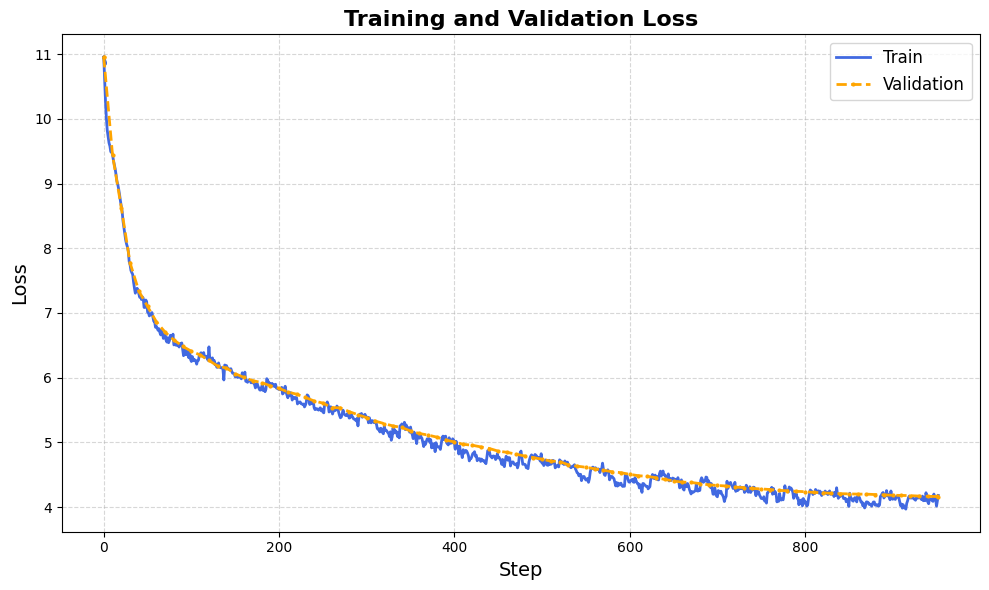

# MiniGPT

A PyTorch implementation of GPT-2 for training language models from scratch, with support for distributed training, gradient accumulation, and evaluation on benchmark datasets.

**For detailed documentation, see [MiniGPT_Notes.pdf](MiniGPT_Notes.pdf).**



---

## 🚀 Features

- **Pure PyTorch Implementation** - Complete GPT-2 architecture implemented from scratch
- **Distributed Training** - Multi-GPU support via Distributed Data Parallel (DDP)
- **Efficient Training** - Flash Attention, mixed precision (bfloat16/float16), gradient accumulation
- **Pretrained Models** - Load weights from HuggingFace GPT-2 models
- **Dataset Support** - FineWeb-Edu dataset preprocessing and HellaSwag evaluation utilities

## 📋 Requirements

```bash
pip install torch tiktoken transformers datasets numpy requests tqdm
```

## 🎯 Usage

**For a dummy training run, see [TrainMiniGpt.ipynb](TrainMiniGpt.ipynb).**

### Single GPU/CPU

```bash
python train_gpt2.py
```

### Multi-GPU Training

```bash
torchrun --standalone --nproc_per_node=8 train_gpt2.py
```

### Dataset Preprocessing

**FineWeb-Edu dataset:**
```bash
python fineweb.py
```

**HellaSwag evaluation:**
```bash
python hellaswag.py
```

## 📁 Project Structure

```
GPT2/
├── train_gpt2.py          # Main training script with GPT-2 implementation
├── TrainMiniGpt.ipynb     # Notebook implementation for dummy training runs
├── fineweb.py             # FineWeb-Edu dataset download and tokenization
├── hellaswag.py           # HellaSwag evaluation utilities
├── input.txt              # Training data (text file)
└── MiniGPT_Notes.pdf       # Detailed documentation
```

## ⚙️ Configuration

Key parameters in `train_gpt2.py`:

- **Model Configuration**: `GPTConfig` (n_layer, n_head, n_embd, block_size, vocab_size)
- **Training Hyperparameters**: `total_batch_size`, `B`, `T`, `max_lr`, `warmup_steps`, `max_steps`

**For information about hyperparameters, refer to [MiniGPT_Notes.pdf](MiniGPT_Notes.pdf).**

### Using Pretrained Weights

To initialize from a pretrained HuggingFace GPT-2 model, uncomment:

```python
model = GPT.from_pretrained('gpt2')
```
